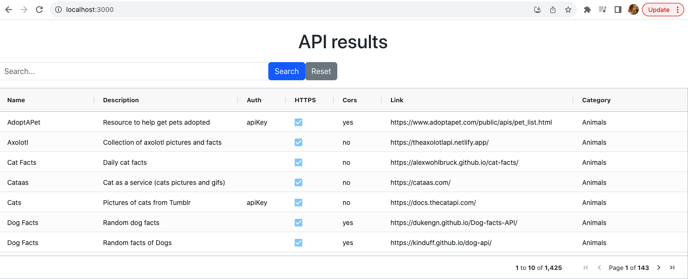

# A React App to display data from a Public API

The application is divided into two distinct projects within a single repository, ensuring scalability and maintaining a clear separation of responsibilities:

**api** - This project is a Spring Boot application responsible for managing backend functionality.

**by-react-app** - This is a React-based application that utilizes AG-Grid to display and populate data.
## Prerequisites

 Ensure you have the following prerequisites installed on your system:

- **Java Development Kit (JDK)**: Version 8 or later.
- **Apache Maven**: You'll need Maven for building the project.
- **Node Package Manager(v9.8.0)**: You'll need npm to install dependencies for React project and run the application.

## Getting Started
### Setting up backend application

Follow these steps to set up, run, and test the application:

1. **Clone the Repository**

```bash
git clone https://github.com/mohandeepak/by-assignment.git
```

2. **Navigate to the api Directory**

```bash
cd by-assignment/api
```

3. **Build the Backend**

```bash

mvn clean install
```

4. **Run the Backend**
Simply run the class ApiApplication.java

The backend will be accessible at http://localhost:8080.


### Setting up frontend application

1. **Navigate to the by-react-app Directory**

```bash
cd by-assignment/by-react-app
```

2. **Install dependencies**
```bash
npm install
```
3. **Run React App**
```bash
npm start
```

The React app will open in your web browser at http://localhost:3000, fetching and displaying data from the Spring Boot backend.



Functionalities currently supported:

1. **Caching** : Implemented on the backend layer for faster retrieval of data.
2. **Pagination** : Implemented client-side for better performance.
3. **Filtering** : Implemented using AG-Grid to filter based on column values.
4. **Sorting**: Sorting based on column values.
5. **Custom Search and Reset**: To search entire set of  records for specific cell value.
6. **Exception handling** : Implemented on backend layer.
7. **Testing**: Covers important test cases for both backend and front end functionalities(Controller tests-backend and Component Tests-Frontend)
8. **GitHub Actions**: To automate build and tests jobs(backend-build.yml, frontend-build.yml)

Additional functionalities that could be incorporated in future:

1. **Automate deployments**(dockerizing apps and deploying it to AWS/GCP)
2. **Improve test coverage : test service layer of backend, test paging/sorting/filtering functionality, integration Tests , etc**
3. **Implement test automation using BDD(Behavior Driven Development)**
4. **Make UI visually appealing**
5. **Add functionality to export data as a csv or any other appropriate format**
6. **Implement Lazy loading**
7. **Implement Client-side caching for offline support**